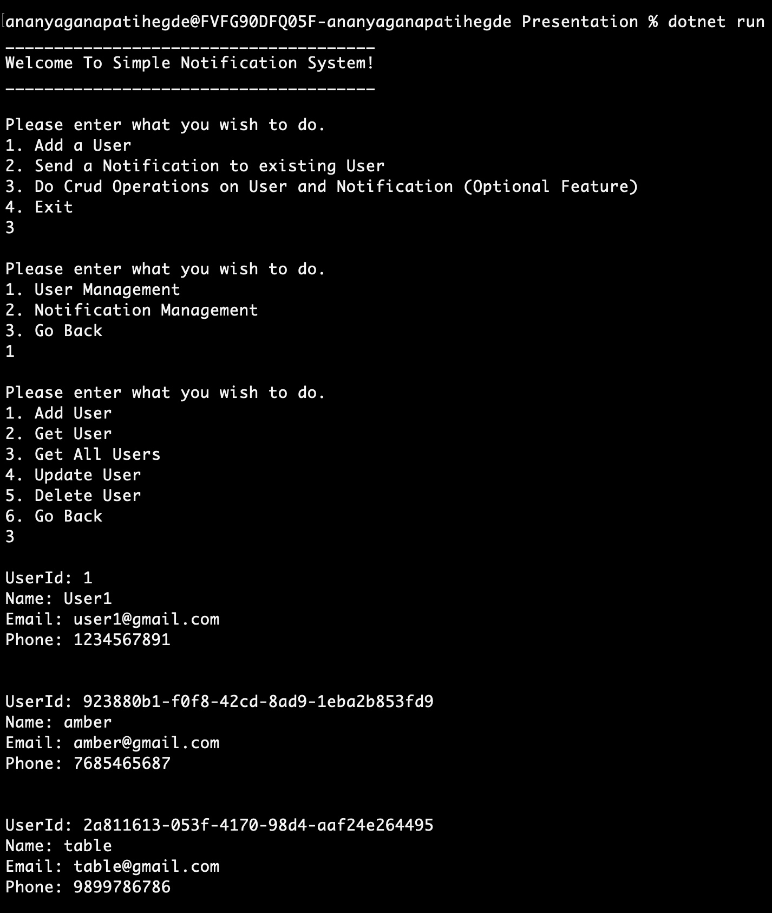
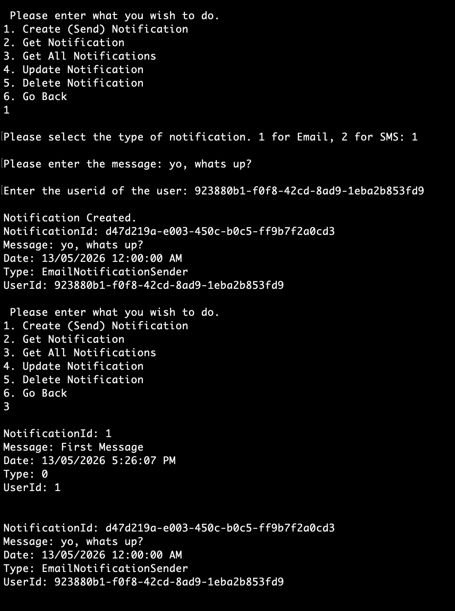
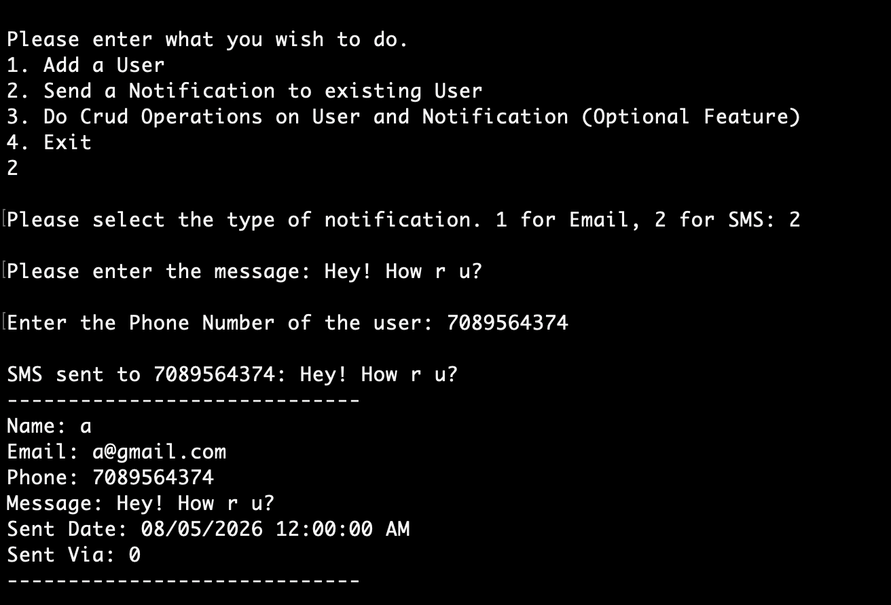

### Setup

Run the following commands in the terminal:
```bash
mkdir NotificationSystem
cd NotificationSystem
```

```bash
dotnet new sln -n Bulletin
dotnet new console -n Presentation
dotnet new classlib -n BusinessLayer
dotnet new classlib -n DataAccessLayer
```

```bash
dotnet sln add Presentation/Presentation.csproj
dotnet sln add BusinessLayer/BusinessLayer.csproj
dotnet sln add DataAccessLayer/DataAccessLayer.csproj
```

```bash
dotnet add Presentation/Presentation.csproj reference BusinessLayer/BusinessLayer.csproj
dotnet add BusinessLayer/BusinessLayer.csproj reference DataAccessLayer/DataAccessLayer.csproj
```

To run the project: 
```bash
cd Presentation
dotnet run
```

## Results




